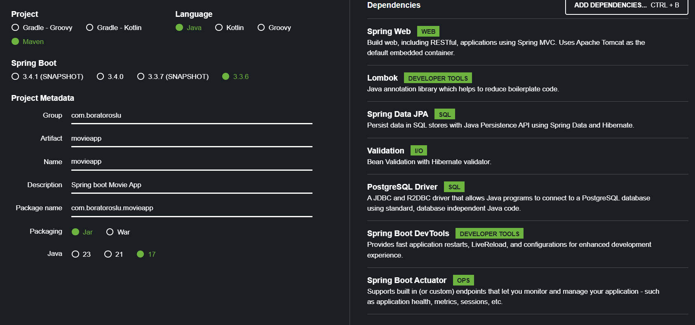

# Spring Boot Film Projesi
Bu proje, Spring Boot kullanarak bir film yönetim uygulaması yapmayı amaçlamaktadır. Uygulama, film bilgilerini tutan basit bir POJO sınıfı ve CRUD (Create, Read, Update, Delete) işlemleri yapabilen bir API'ye sahip olacaktır.

## Bağımlılıklar


## Film Sınıfı
Bu sınıf, film bilgilerini temsil eder.Film adı,yapım yılı,IMDb puanı,yapımcısı,türü gibi özellikleri içerir.

* `id` : **Long** türünde Filmin benzersiz ID'si.
* `filmName` : **String** Filmin adı.
* `releaseYear` : **String** filmin yapım yılı.
* `imdbRating` : **Double** Filmin IMDb puanı.
* `producer` : **String** Filmin yapımıncısı.
* `genre` : **String** Filmin türü.
* 
## FilmService
CRUD operasyonlarını gerçekleştiren bir servis sınıfıdır.
## FilmController
HTTP isteklerini karşılayan bir kontrolör sınıfıdır. FilmService'i kullanarak CRUD operasyonlarını çağırır.
## FilmRepository
`FilmRepository`film nesnelerini depolamak ve çeşitli veritabanı işlemlerini gerçekleştirmek için kullanılır.Bu repository,Spring Data JPA tarafından sağlanan özellikleri kullanarak veritabanı ile etkileşimde bulunur.
## API Endpointleri
- Film Listeleme: (GET /films)
  - Açıklama: Tüm filmleri listeleyen endpoint.
  - Yöntem: GET
  - URL: /films


- Film Ekleme: (POST /films)
  - Açıklama: Yeni bir film ekler.
  - Yöntem: POST
  - URL: /films


- Film Güncelleme: (PUT /films/{id})
   - Açıklama: Belirtilen ID'ye sahip filmi günceller.
   - Yöntem: PUT
   - URL: /films/{id}


- Film Silme: (DELETE /films/{id})
   - Açıklama: Belirtilen ID'ye sahip filmi siler.
   - Yöntem: DELETE
   - URL: /films/{id}


- Film Detayı: (GET /films/{id})
   - Açıklama: Belirtilen ID'ye sahip bir filmin detaylarını getirir.
   - Yöntem: GET
   - URL: /films/{id}

## Örnek Film JSON Formatı
````
{
  "name": "The Dark Knight",
  "releaseYear": 2008,
  "imdbRating": 9.0,
  "producer": "Warner Bros.",
  "genre": "Action"
}
````